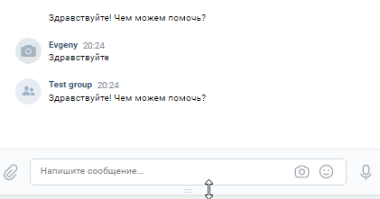

# Telegram, VK чат боты

Боты для автоматизации обработки обращений клиентов, сотрудников, потребителей услуг.

#### Пример работы Telegram


#### Пример работы VK


## Как установить

### Окружение
Python должен быть установлен.

### Установка
Установите программу из репозитория:
```bash
git clone https://github.com/evgeniya35/CHAT_BOT_3_recognize_speech.git

```

### Зависимости
Используйте pip для установки зависимостей:
```bash
pip install -r requirements.txt
```

Для работы необходимо поместить в файл `.env` переменные окружения:
```
TG_CHAT_ID={Идентификатор телеграм чата для админ сообщений}
TG_TOKEN_ADMIN={Токен телеграм бота для админ сообщений}
TG_TOKEN={Токен телеграм бота для диалога}
VK_APP_TOKEN={Токен группы VK бота для диалога}

DF_PROJECT_ID={Идентификатор проекта в Google Cloud Console}
GOOGLE_APPLICATION_CREDENTIALS={Путь к файлу с ключами DialogFlow}
```
- Как создать Telegram бота: обратитесь к [BotFather](https://telegram.me/BotFather).
- Как получить токен группы VK: Создайте группу в [Управление группами](https://vk.com/groups?tab=admin); Создайте токен в разделе `Работа с API`.
- [Проект в DialogFlow](https://cloud.google.com/dialogflow/docs/quick/setup).
- [Создать агента DialogFlow](https://cloud.google.com/dialogflow/docs/quick/build-agent).
- [Создание JSON-ключа](https://cloud.google.com/docs/authentication/getting-started).

## Тренировка DialogFlow
Для обучения бота создайте файл `questions.json` с содержанием навыков, пример:
```json
 {
    "Расчёты": {
        "questions": [
            "Ошибка в расчётах",
            "Сделать перерасчёт",
            "Не получил счёт",
            "Ошибка в счёте"
        ],
        "answer": "Обратитесь пожалуйста в отдел расчётов по телефону 1234567890 в будние дни с 08:00 до 17:00."
    },
    "Абонент": {
        "questions": [
            "Как получить услугу",
            "Заменить оборудование",
            "Отказаться от услуг",
            "Сменить тариф"
        ],
        "answer": "Обратитесь пожалуйста в абонентский отдел по телефону 1234567890 в будние дни с 08:00 до 17:00."
    },
    .....
}
```
Обучите DialogFlow командой:
```bash
python create_intent.py
```


## Запуск

Для запуска Telegram бота используйте командную строку:
```bash
$ python tg_bot.py
```
Для запуска VK бота используйте командную строку:
```bash
$ python vk_bot.py
```

### Цель проекта

Код написан в образовательных целях на онлайн-курсе для веб-разработчиков [dvmn.org](https://dvmn.org/).